# Lyra: System Architecture Documentation
## Autonomous Technical Writing Agent

**Version**: 1.0  
**Date**: 2025  
**Author**: System Architecture Team  
**Status**: Phase 1 Design

---

## Table of Contents

1. [Executive Summary](#executive-summary)
2. [System Overview](#system-overview)
3. [High-Level Architecture](#high-level-architecture)
4. [Component Architecture](#component-architecture)
5. [Agent Workflow](#agent-workflow)
6. [Data Flow](#data-flow)
7. [Tool Architecture](#tool-architecture)
8. [Smart Tools Pattern](#smart-tools-pattern)
9. [Document Lifecycle](#document-lifecycle)
10. [Technology Stack](#technology-stack)
11. [Security & Authentication](#security--authentication)
12. [Deployment Architecture](#deployment-architecture)

---

## Executive Summary

### What is Lyra?

**Lyra** is an autonomous AI agent that acts as a junior technical writer, capable of creating, updating, and maintaining documentation by intelligently gathering information from multiple enterprise data sources.

### The Problem Lyra Solves

**Knowledge Fragmentation in Enterprises**:
- Decisions scattered across Jira comments, Confluence pages, Slack threads
- Implementation details in GitHub/GitLab PRs and code
- Requirements in Google Docs
- No single source of truth
- Manual documentation is slow, error-prone, and quickly outdated

### The Lyra Solution

**Autonomous Documentation Generation**:
- **Searches** 6+ data sources automatically
- **Follows** links between related information (Jira → GitHub → Confluence)
- **Distills** raw data into actionable knowledge using LLMs
- **Synthesizes** comprehensive documentation
- **Maintains** docs through create, update, delete, audit operations

### Key Capabilities

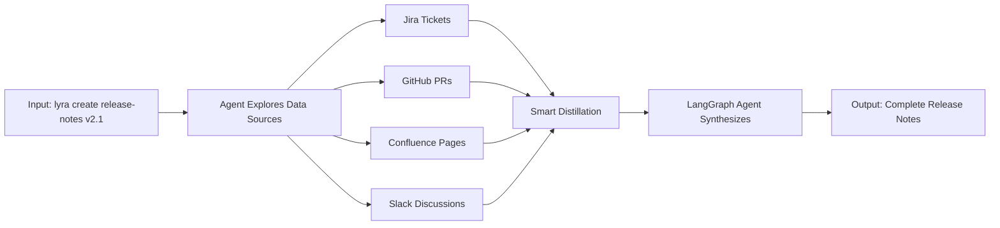

---

## System Overview

### System Context Diagram

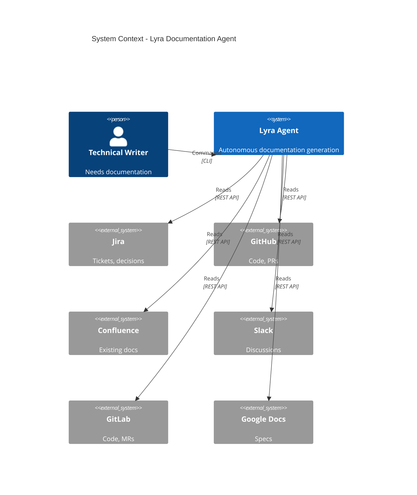

### Primary Use Cases

**Phase 1 Use Cases**:
1. **Create Release Notes**: Gather info from Jira/GitHub, generate comprehensive release notes
2. **Create Help Documentation**: Research topic across sources, create how-to guides
3. **Audit Documentation**: Find outdated docs by checking against current codebase
4. **Update Documentation**: Modify existing docs when features change
5. **Delete Documentation**: Deprecate or remove docs for removed features

**Phase 2+ Use Cases** (Future):
- Automatic documentation generation on release triggers
- Proactive identification of documentation gaps
- Multi-project documentation management

---

## High-Level Architecture

### Layered Architecture Diagram

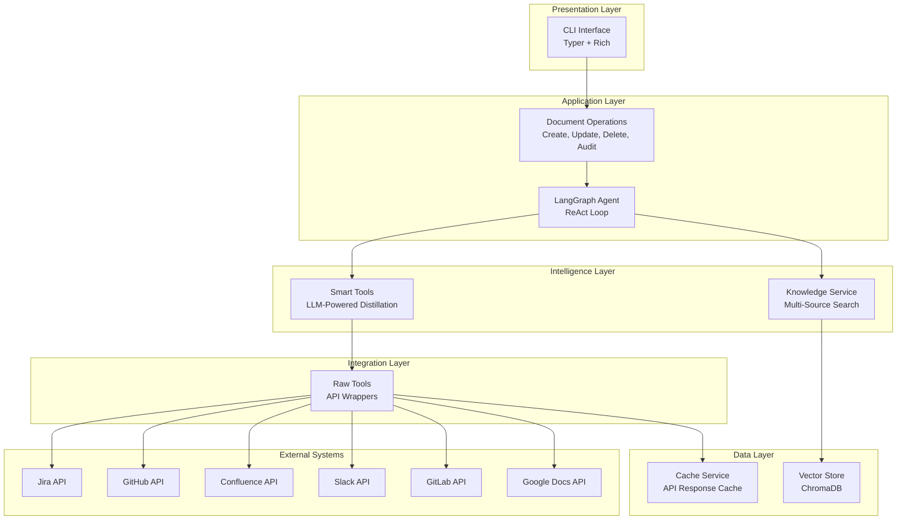

### Architectural Patterns

**Pattern 1: Modular Agent Nodes**
- Each agent capability (planning, execution, synthesis, critique) is a separate module
- Enables independent testing and development
- Controller assembles nodes into workflow

**Pattern 2: Smart Tools**
- Raw tools fetch data (API wrappers)
- Smart tools distill data (LLM-powered)
- Agent prefers smart tools (cleaner reasoning)
- Raw tools available as fallback

**Pattern 3: ReAct Loop**
- **Reason**: Plan what information to gather
- **Act**: Execute tools to gather information
- **Observe**: Process results
- Repeat until sufficient knowledge gathered

---

## Component Architecture

### Component Diagram

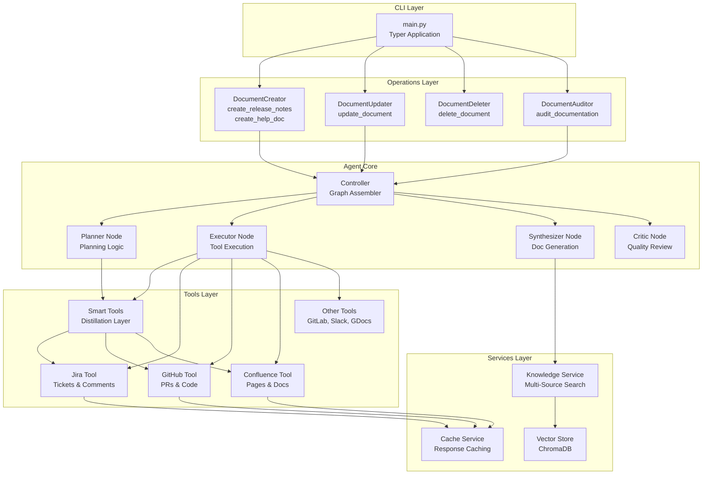

### Component Responsibilities

| Component | Responsibility | Key Functions |
|-----------|---------------|---------------|
| **CLI** | User interface | Command parsing, output formatting |
| **Operations** | Business logic | Orchestrate agent for specific tasks |
| **Agent Core** | Autonomous reasoning | Plan, execute, synthesize, critique |
| **Smart Tools** | Knowledge distillation | Summarize raw data using LLM |
| **Raw Tools** | Data access | API wrappers, authentication |
| **Services** | Supporting functionality | Search, caching, storage |

---

## Agent Workflow

### Complete ReAct Loop

```mermaid
stateDiagram-v2
    [*] --> Initialize
    Initialize --> Planner: Start with goal
    
    Planner --> Decision1{Enough<br/>Knowledge?}
    Decision1 --> Executor: No, need more
    Decision1 --> Synthesizer: Yes, ready to write
    
    Executor --> ToolCall: Execute tools
    ToolCall --> UpdateKnowledge: Add to knowledge bundle
    UpdateKnowledge --> Planner: Loop back
    
    Synthesizer --> GenerateDraft: Create document
    GenerateDraft --> Critic: Review quality
    
    Critic --> Decision2{Approved?}
    Decision2 --> [*]: Yes, done!
    Decision2 --> Decision3{Max<br/>Revisions?}: No, needs work
    Decision3 --> Synthesizer: Revise (< 3 attempts)
    Decision3 --> [*]: Give up (>= 3 attempts)
```

### Detailed Agent Flow

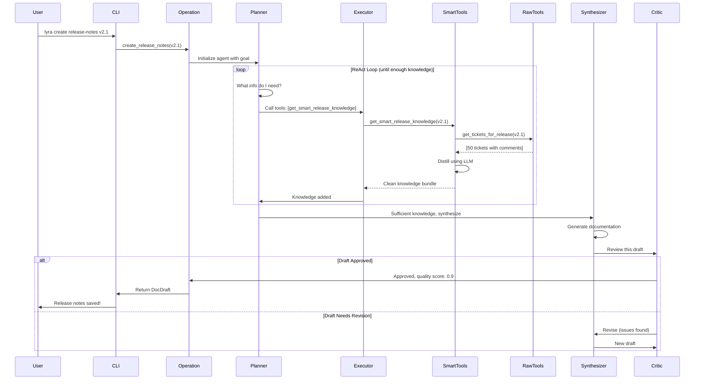

### State Management

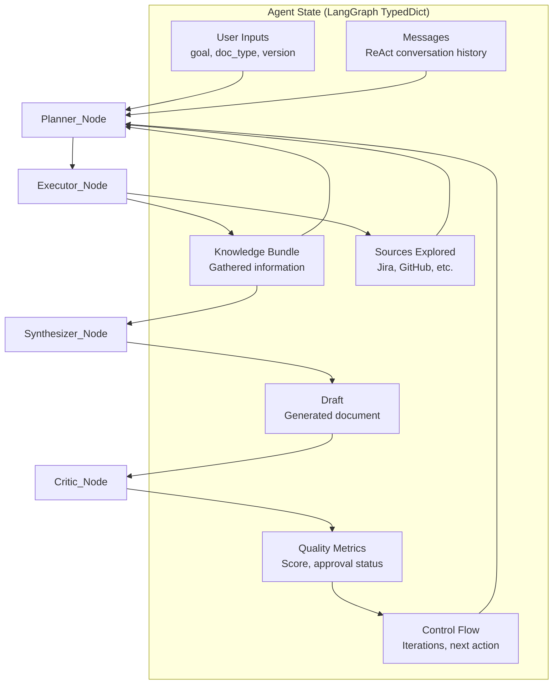

---

## Data Flow

### Information Gathering Flow

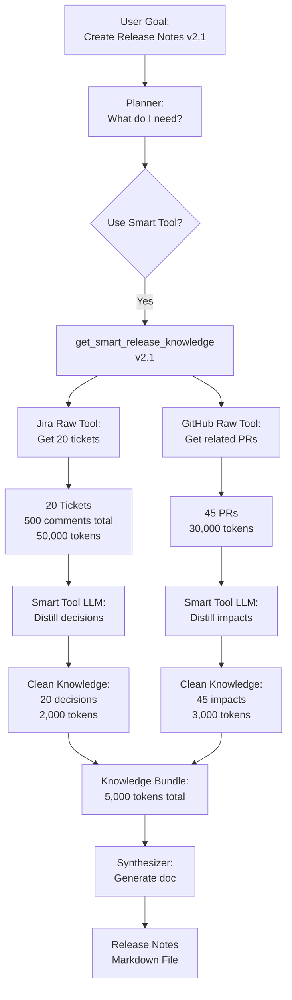

### Token Economy (Smart Tools vs Raw)

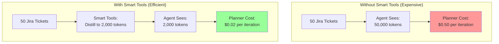

---

## Component Architecture

### 1. CLI Layer

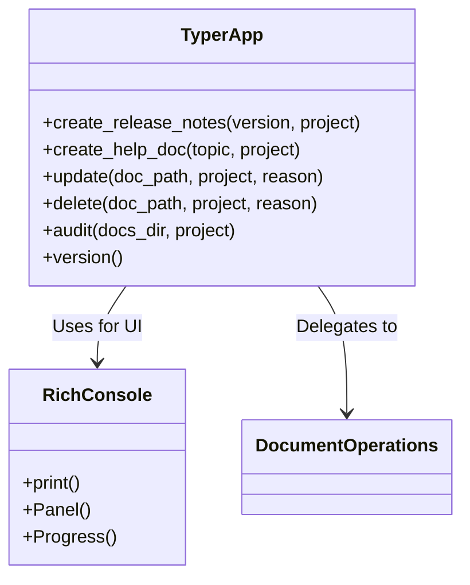

**Technologies**: Typer (CLI framework), Rich (beautiful terminal output)

---

### 2. Operations Layer

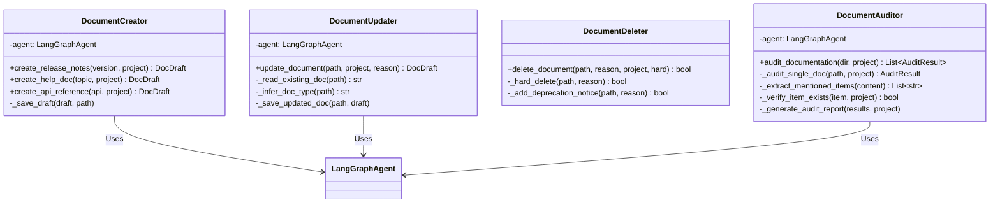

**Responsibilities**:
- **DocumentCreator**: Orchestrates agent for document creation
- **DocumentUpdater**: Orchestrates agent for document updates
- **DocumentDeleter**: Direct file operations (no agent needed)
- **DocumentAuditor**: Orchestrates agent for finding outdated docs

---

### 3. Agent Core (LangGraph)

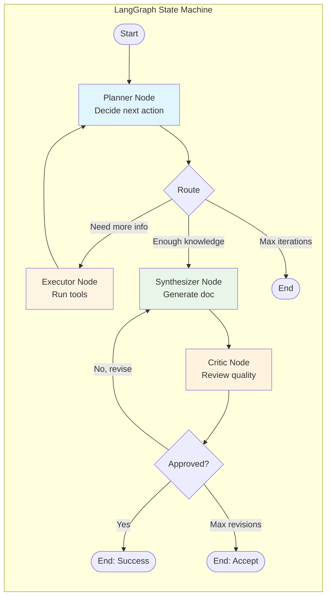

### Agent Node Details

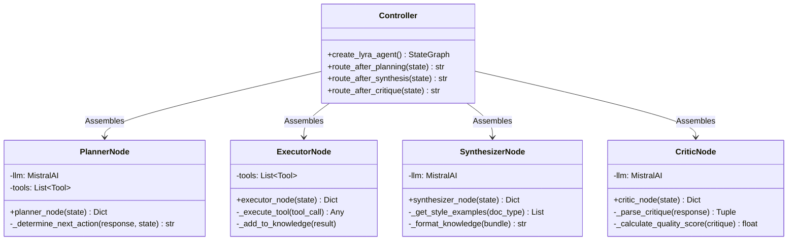

---

### 4. Tools Architecture

```mermaid
graph TB
    subgraph "Tool Registry"
        REGISTRY[get_all_tools<br/>Returns 18 tools]
    end
    
    subgraph "Smart Tools (3)"
        ST1[get_smart_release_knowledge<br/>Full release aggregation]
        ST2[get_ticket_decision_summary<br/>Single ticket distillation]
        ST3[get_pr_impact_summary<br/>PR impact distillation]
        ST4[get_confluence_key_points<br/>Confluence distillation]
    end
    
    subgraph "Raw Tools - Jira (4)"
        J1[search_jira_tickets<br/>JQL search]
        J2[get_jira_ticket<br/>Single ticket + comments]
        J3[get_jira_release_tickets<br/>All tickets for version]
        J4[get_linked_jira_tickets<br/>Follow issue links]
    end
    
    subgraph "Raw Tools - GitHub (4)"
        G1[search_github_prs<br/>Search PRs]
        G2[get_github_pr<br/>Single PR + diff]
        G3[find_github_prs_for_ticket<br/>PRs referencing ticket]
        G4[check_github_file_exists<br/>Verify file in repo]
    end
    
    subgraph "Raw Tools - Other (7)"
        C1[search_confluence_pages]
        C2[get_confluence_page]
        GL1[search_gitlab_merge_requests]
        S1[search_slack_messages]
        GD1[search_google_docs]
        GD2[get_google_doc]
    end
    
    REGISTRY --> ST1 & ST2 & ST3 & ST4
    REGISTRY --> J1 & J2 & J3 & J4
    REGISTRY --> G1 & G2 & G3 & G4
    REGISTRY --> C1 & C2 & GL1 & S1 & GD1 & GD2
    
    ST1 -.->|Uses| J3 & G3
    ST2 -.->|Uses| J2
    ST3 -.->|Uses| G2
    ST4 -.->|Uses| C2
```

### Tool Inheritance Hierarchy

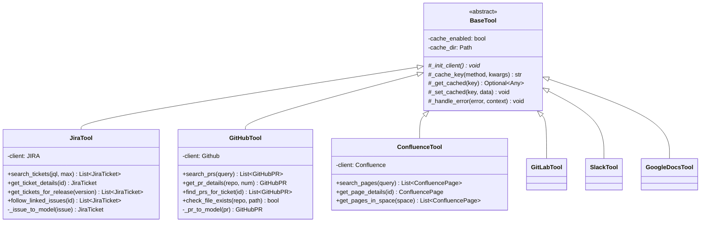

---

## Smart Tools Pattern

### The Distillation Pipeline

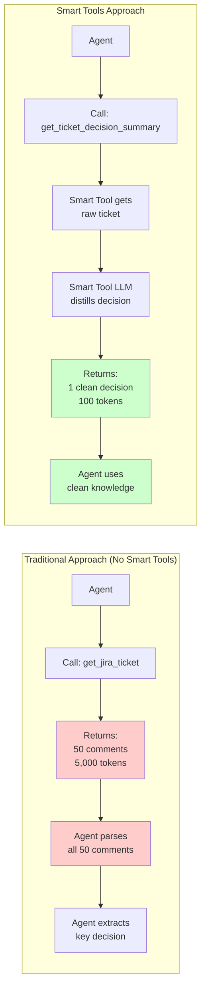

### Smart Tool Components

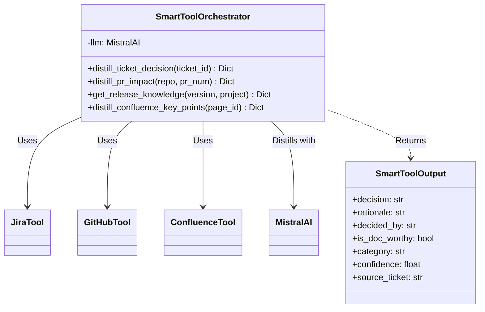

### Comparison: Raw vs Smart Tool Output

**Raw Tool Output**:
```json
{
  "ticket_id": "OPSHIFT-123",
  "summary": "Add OAuth 2.1 support",
  "description": "Long description...",
  "comments": [
    {"author": "User1", "body": "What about OAuth 2.0?"},
    {"author": "User2", "body": "No, use 2.1"},
    {"author": "User3", "body": "I agree with 2.1"},
    {"author": "User1", "body": "Why not 2.0?"},
    {"author": "TechLead", "body": "2.1 is industry standard. Approved."},
    ...45 more comments...
  ]
}
// 5,000 tokens that agent must parse
```

**Smart Tool Output**:
```json
{
  "decision": "Use OAuth 2.1 for SSO authentication",
  "rationale": "Industry standard, better security than OAuth 2.0",
  "decided_by": "Tech Lead (approved in final comment)",
  "is_doc_worthy": true,
  "category": "feature",
  "confidence": 0.95,
  "source_ticket": "OPSHIFT-123"
}
// 100 tokens of distilled knowledge
```

---

## Document Lifecycle

### Complete CRUD Operations

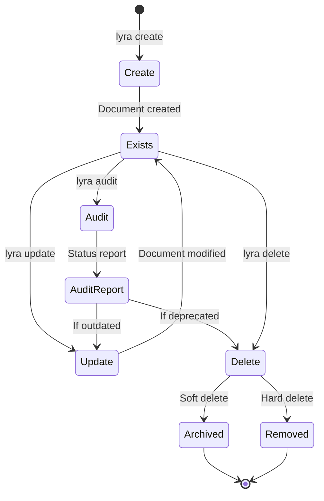

### Document Creation Workflow

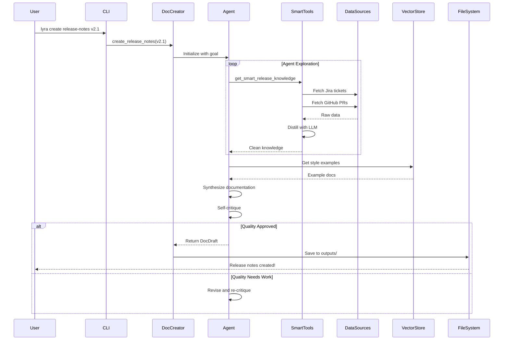

### Document Update Workflow

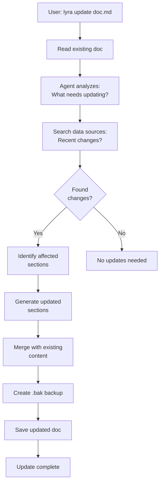

### Audit Workflow

```mermaid
flowchart TD
    START[User: lyra audit ./docs] --> SCAN[Scan all .md files<br/>in directory]
    
    SCAN --> DOC1[For each document]
    DOC1 --> EXTRACT[Extract mentioned:<br/>APIs, features, endpoints]
    
    EXTRACT --> VERIFY{Verify each<br/>in codebase}
    
    VERIFY -->|Exists| CURRENT[Mark: Current]
    VERIFY -->|Not found| OUTDATED[Mark: Outdated]
    
    CURRENT --> NEXT{More docs?}
    OUTDATED --> NEXT
    
    NEXT -->|Yes| DOC1
    NEXT -->|No| REPORT[Generate audit<br/>report]
    
    REPORT --> SUMMARY[Show summary:<br/>X current<br/>Y outdated<br/>Z deprecated]
```

---

## Technology Stack

### Technology Layers

```mermaid
graph TB
    subgraph "User Interface"
        A1[Typer - CLI Framework]
        A2[Rich - Terminal UI]
    end
    
    subgraph "AI/LLM Layer"
        B1[Mistral AI - Language Model]
        B2[LangChain - LLM Framework]
        B3[LangGraph - Agent Orchestration]
    end
    
    subgraph "Data Processing"
        C1[Pydantic - Data Validation]
        C2[ChromaDB - Vector Store]
        C3[Sentence Transformers - Embeddings]
    end
    
    subgraph "External Integrations"
        D1[jira - Jira API Client]
        D2[PyGithub - GitHub API Client]
        D3[python-gitlab - GitLab API]
        D4[atlassian-python-api - Confluence]
        D5[slack-sdk - Slack API]
        D6[google-api-python-client - Google Docs]
    end
    
    subgraph "Development Tools"
        E1[pytest - Testing]
        E2[black - Code Formatting]
        E3[ruff - Linting]
    end
```

### Dependency Graph

```mermaid
graph TD
    LYRA[Lyra Agent]
    
    LYRA --> LANGGRAPH[LangGraph 0.0.40+]
    LANGGRAPH --> LANGCHAIN[LangChain 0.1.0+]
    
    LYRA --> MISTRAL[langchain-mistralai]
    MISTRAL --> LANGCHAIN
    
    LYRA --> JIRA[jira 3.5.0+]
    LYRA --> PYGITHUB[PyGithub 2.1.1+]
    LYRA --> CONFLUENCE[atlassian-python-api]
    LYRA --> GITLAB[python-gitlab]
    LYRA --> SLACK[slack-sdk]
    LYRA --> GDOCS[google-api-python-client]
    
    LYRA --> CHROMA[chromadb 0.4.22+]
    CHROMA --> SENTENCE[sentence-transformers]
    
    LYRA --> TYPER[typer]
    LYRA --> RICH[rich]
    LYRA --> PYDANTIC[pydantic 2.5.0+]
```

---

## Data Models

### Core Data Model Relationships

```mermaid
classDiagram
    class SourceReference {
        +source_type: Literal
        +source_id: str
        +url: HttpUrl
        +title: str
        +excerpt: Optional~str~
        +timestamp: datetime
        +metadata: Dict
    }
    
    class JiraTicket {
        +id: str
        +key: str
        +summary: str
        +description: str
        +status: str
        +comments: List~JiraComment~
        +linked_issues: List~str~
        +fix_versions: List~str~
        +url: HttpUrl
    }
    
    class JiraComment {
        +id: str
        +author: str
        +body: str
        +created: datetime
    }
    
    class GitHubPR {
        +id: int
        +number: int
        +title: str
        +body: str
        +state: str
        +linked_issues: List~str~
        +diff_summary: str
        +url: HttpUrl
    }
    
    class DocDraft {
        +doc_type: Literal
        +title: str
        +content: str
        +citations: List~Citation~
        +sources_consulted: List~SourceReference~
        +confidence_score: float
        +metadata: Dict
    }
    
    class Citation {
        +claim: str
        +sources: List~SourceReference~
        +confidence: float
        +verified: bool
    }
    
    JiraTicket "1" --o "*" JiraComment: contains
    DocDraft "1" --o "*" Citation: includes
    Citation "1" --o "*" SourceReference: references
    DocDraft "1" --o "*" SourceReference: consulted
```

---

## Agent Workflow (Detailed)

### Phase 1: Planning & Exploration

```mermaid
sequenceDiagram
    participant Planner
    participant Executor
    participant SmartTool
    participant JiraAPI
    participant GitHubAPI
    
    Note over Planner: Goal: Create release notes for v2.1
    
    Planner->>Planner: Analyze goal
    Planner->>Planner: Current knowledge: Empty
    Planner->>Planner: Decision: Need release info
    
    Planner->>Executor: Tool call: get_smart_release_knowledge(v2.1)
    
    Executor->>SmartTool: Execute smart tool
    
    SmartTool->>JiraAPI: get_tickets_for_release(v2.1)
    JiraAPI-->>SmartTool: [20 tickets, 500 comments]
    
    loop For each ticket
        SmartTool->>SmartTool: LLM distill decision
        SmartTool->>GitHubAPI: find_prs_for_ticket(TICKET-X)
        GitHubAPI-->>SmartTool: [Related PRs]
        SmartTool->>SmartTool: LLM distill PR impacts
    end
    
    SmartTool-->>Executor: Clean knowledge bundle:<br/>{features: [...], bugs: [...]}
    Executor->>Planner: Knowledge added to bundle
    
    Planner->>Planner: Check: Enough knowledge?
    Planner->>Planner: Decision: Yes, 20 items from 2 sources
```

### Phase 2: Synthesis & Critique

```mermaid
sequenceDiagram
    participant Planner
    participant Synthesizer
    participant VectorStore
    participant MistralAI
    participant Critic
    
    Planner->>Synthesizer: Transition: Begin synthesis
    
    Synthesizer->>VectorStore: Get style examples (release_notes)
    VectorStore-->>Synthesizer: [2 example docs]
    
    Synthesizer->>Synthesizer: Build synthesis prompt:<br/>Knowledge + Style examples
    
    Synthesizer->>MistralAI: Generate release notes
    Note over MistralAI: Temperature: 0.3<br/>(creative writing)
    
    MistralAI-->>Synthesizer: Generated markdown
    
    Synthesizer->>Synthesizer: Create DocDraft object
    Synthesizer->>Critic: Review this draft
    
    Critic->>Critic: Build critique prompt
    Critic->>MistralAI: Evaluate quality
    Note over MistralAI: Temperature: 0.1<br/>(consistent critique)
    
    MistralAI-->>Critic: Critique analysis
    
    alt High Quality (score > 0.8)
        Critic->>Planner: Approved! Quality: 0.9
    else Needs Revision (score < 0.8)
        Critic->>Synthesizer: Revise (issues: ...)
    end
```

---

## Knowledge Service Architecture

### Vector Store & Search

```mermaid
graph TB
    subgraph "Input Sources"
        I1[Existing Docs]
        I2[Jira Tickets]
        I3[Confluence Pages]
    end
    
    subgraph "Processing"
        SPLIT[Text Splitter<br/>1000 char chunks<br/>200 overlap]
        EMBED[Sentence Transformers<br/>all-MiniLM-L6-v2]
    end
    
    subgraph "Storage"
        CHROMA[(ChromaDB<br/>Vector Store)]
    end
    
    subgraph "Retrieval"
        SEARCH[Semantic Search]
        FILTER[Filter by source_type]
        RANK[Rank by relevance]
    end
    
    I1 --> SPLIT
    I2 --> SPLIT
    I3 --> SPLIT
    
    SPLIT --> EMBED
    EMBED --> CHROMA
    
    CHROMA --> SEARCH
    SEARCH --> FILTER
    FILTER --> RANK
    RANK --> RESULTS[Top K Results]
```

### Knowledge Assembly Process

```mermaid
flowchart TD
    START[Agent needs knowledge] --> SMART{Use Smart<br/>Tool?}
    
    SMART -->|Yes| SMART_CALL[Call smart tool:<br/>e.g., get_smart_release_knowledge]
    SMART -->|No| RAW_CALL[Call raw tool:<br/>e.g., search_jira_tickets]
    
    SMART_CALL --> RAW_FETCH[Smart tool fetches raw data]
    RAW_FETCH --> DISTILL[LLM distills:<br/>Extract decisions, filter noise]
    DISTILL --> CLEAN[Clean, structured knowledge]
    
    RAW_CALL --> RAW_DATA[Raw, unfiltered data]
    
    CLEAN --> BUNDLE[Knowledge Bundle]
    RAW_DATA --> BUNDLE
    
    BUNDLE --> CHECK{Enough<br/>knowledge?}
    CHECK -->|No| START
    CHECK -->|Yes| SYNTH[Proceed to synthesis]
```

---

## Caching Strategy

### Multi-Level Caching Architecture

```mermaid
graph TB
    subgraph "Request Flow"
        REQ[Tool Request:<br/>get_jira_ticket OPSHIFT-123]
    end
    
    subgraph "Cache Layer"
        L1{L1: In-Memory<br/>Cache?}
        L2{L2: File System<br/>Cache?}
    end
    
    subgraph "External API"
        API[Jira API Call]
    end
    
    subgraph "Cache Storage"
        MEM[Memory Dict]
        DISK[./data/cache/<br/>jira_tool/<br/>abc123.json]
    end
    
    REQ --> L1
    L1 -->|Hit| RETURN1[Return cached]
    L1 -->|Miss| L2
    
    L2 -->|Hit| RETURN2[Return cached<br/>+ Update L1]
    L2 -->|Miss| API
    
    API --> RESPONSE[API Response]
    RESPONSE --> STORE[Store in L1 + L2]
    STORE --> RETURN3[Return fresh data]
    
    MEM -.->|TTL: 1 hour| L1
    DISK -.->|TTL: 1 hour| L2
```

### Cache Benefits

```mermaid
pie title API Call Reduction with Caching
    "Cached (70%)" : 70
    "Fresh API Calls (30%)" : 30
```

---

## Security & Authentication

### Authentication Flow

```mermaid
sequenceDiagram
    participant Lyra
    participant EnvFile
    participant Settings
    participant JiraTool
    participant JiraAPI
    
    Note over Lyra: Application starts
    
    Lyra->>EnvFile: Load .env file
    EnvFile-->>Settings: Environment variables
    
    Settings->>Settings: Validate with Pydantic
    
    Note over JiraTool: Tool initialization
    
    JiraTool->>Settings: Get credentials
    Settings-->>JiraTool: JIRA_SERVER, JIRA_USER, JIRA_API_TOKEN
    
    JiraTool->>JiraAPI: Authenticate (Basic Auth)
    
    alt Authentication Success
        JiraAPI-->>JiraTool: Connection established
    else Authentication Failure
        JiraAPI-->>JiraTool: 401 Unauthorized
        JiraTool->>Lyra: Error: Check credentials
    end
```

### Credentials Management

```mermaid
graph TD
    subgraph "Development (.env file)"
        DEV_ENV[.env<br/>Plain text credentials]
    end
    
    subgraph "Production (Recommended)"
        VAULT[AWS Secrets Manager /<br/>HashiCorp Vault]
    end
    
    subgraph "Application"
        SETTINGS[Pydantic Settings]
    end
    
    DEV_ENV -.->|Phase 1| SETTINGS
    VAULT -.->|Production| SETTINGS
    
    SETTINGS --> TOOLS[All Tools]
    
    style DEV_ENV fill:#ffeecc
    style VAULT fill:#ccffcc
```

---

## Error Handling & Resilience

### Error Propagation

```mermaid
flowchart TD
    TOOL[Tool Call] --> TRY{Try}
    
    TRY -->|Success| CACHE[Cache result]
    CACHE --> RETURN[Return to agent]
    
    TRY -->|API Error| LOG1[Log error]
    LOG1 --> HANDLE1[Return error message<br/>to agent]
    
    TRY -->|Network Error| LOG2[Log error]
    LOG2 --> RETRY{Retry?}
    
    RETRY -->|< 3 attempts| WAIT[Wait 1s]
    WAIT --> TRY
    
    RETRY -->|>= 3 attempts| HANDLE2[Return error<br/>to agent]
    
    HANDLE1 --> AGENT[Agent sees error<br/>in knowledge bundle]
    HANDLE2 --> AGENT
    
    AGENT --> DECIDE{Agent decides}
    DECIDE -->|Try different tool| ALT[Use alternative source]
    DECIDE -->|Continue anyway| PROCEED[Proceed with partial knowledge]
    DECIDE -->|Critical error| FAIL[Report to user]
```

### Graceful Degradation

```mermaid
graph LR
    subgraph "Ideal Case"
        I1[6 Data Sources<br/>Available]
        I2[High Quality<br/>Documentation]
    end
    
    subgraph "Degraded Case 1"
        D1[4 Data Sources<br/>Available]
        D2[Good Quality<br/>Documentation]
        D3[Warning: Limited sources]
    end
    
    subgraph "Degraded Case 2"
        M1[2 Data Sources<br/>Available]
        M2[Acceptable Quality<br/>Documentation]
        M3[Warning: Minimal sources]
    end
    
    subgraph "Failure Case"
        F1[0-1 Data Sources<br/>Available]
        F2[Cannot Generate<br/>Documentation]
        F3[Error: Insufficient data]
    end
    
    I1 --> I2
    D1 --> D2 --> D3
    M1 --> M2 --> M3
    F1 --> F2 --> F3
```

---

## Performance & Scalability

### Execution Timeline

```mermaid
gantt
    title Typical Release Notes Generation (20 tickets)
    dateFormat X
    axisFormat %S s
    
    section Exploration
    Fetch Jira tickets      :0, 5s
    Distill 20 tickets      :5s, 30s
    Fetch GitHub PRs        :35s, 10s
    Distill 45 PRs          :45s, 60s
    
    section Synthesis
    Get style examples      :105s, 3s
    Generate documentation  :108s, 20s
    
    section Critique
    Review quality          :128s, 10s
    
    section Output
    Save file               :138s, 1s
```

**Total Time**: ~140 seconds (2.3 minutes) for 20 tickets

### Cost Analysis

```mermaid
graph TD
    subgraph "Per Release Notes Generation"
        A[20 Jira Tickets]
        B[45 GitHub PRs]
        C[Distillation: 65 LLM calls]
        D[Synthesis: 1 LLM call]
        E[Critique: 1 LLM call]
        
        A --> C
        B --> C
        C --> F[Total Input: ~100K tokens]
        D --> F
        E --> F
        
        F --> G[Total Output: ~5K tokens]
        
        G --> H[Estimated Cost: $0.10-0.15]
    end
    
    style H fill:#ccffcc
```

### Scalability Considerations

```mermaid
graph LR
    subgraph "Current (Phase 1)"
        C1[Single Project<br/>OpenShift]
        C2[Synchronous Execution]
        C3[Local ChromaDB]
        C4[Cost: ~$0.15 per release]
    end
    
    subgraph "Future (Phase 2+)"
        F1[Multiple Projects<br/>10+ projects]
        F2[Async Execution<br/>Parallel tool calls]
        F3[Distributed Vector Store]
        F4[Cost: ~$1-2 per batch]
    end
    
    C1 -.Evolves to.-> F1
    C2 -.Evolves to.-> F2
    C3 -.Evolves to.-> F3
    C4 -.Scales to.-> F4
```

---

## Deployment Architecture

### Phase 1 Deployment (Local/Developer Machine)

```mermaid
graph TB
    subgraph "Developer Machine"
        subgraph "Virtual Environment"
            LYRA[Lyra CLI<br/>Python Application]
            CHROMA[ChromaDB<br/>Local Storage]
        end
        
        subgraph "File System"
            ENV[.env<br/>Credentials]
            CACHE[./data/cache/<br/>API Responses]
            VECTOR[./data/vector_db/<br/>Embeddings]
            OUTPUT[./outputs/<br/>Generated Docs]
        end
    end
    
    subgraph "External Services"
        MISTRAL[Mistral AI API]
        JIRA[Jira Cloud]
        GITHUB[GitHub API]
        CONFLUENCE[Confluence Cloud]
    end
    
    LYRA --> ENV
    LYRA --> CHROMA
    CHROMA --> VECTOR
    LYRA --> CACHE
    LYRA --> OUTPUT
    
    LYRA --> MISTRAL
    LYRA --> JIRA
    LYRA --> GITHUB
    LYRA --> CONFLUENCE
```

### Phase 2+ Deployment (Server/Cloud)

```mermaid
graph TB
    subgraph "User Interface"
        WEB[Web Dashboard]
        CLI_CLIENT[CLI Client]
    end
    
    subgraph "Application Tier"
        API[FastAPI Server]
        WORKER[Celery Workers<br/>Background Tasks]
        LYRA_AGENT[Lyra Agent<br/>Instances]
    end
    
    subgraph "Data Tier"
        REDIS[(Redis<br/>Cache)]
        POSTGRES[(PostgreSQL<br/>Metadata)]
        CHROMA_CLOUD[(ChromaDB Cloud<br/>Vectors)]
    end
    
    subgraph "External Services"
        MISTRAL_API[Mistral AI]
        DATA_SOURCES[Jira, GitHub, etc.]
    end
    
    WEB --> API
    CLI_CLIENT --> API
    API --> WORKER
    WORKER --> LYRA_AGENT
    
    LYRA_AGENT --> REDIS
    LYRA_AGENT --> POSTGRES
    LYRA_AGENT --> CHROMA_CLOUD
    LYRA_AGENT --> MISTRAL_API
    LYRA_AGENT --> DATA_SOURCES
```

---

## Data Flow Patterns

### Pattern 1: Autonomous Exploration (Link Following)

```mermaid
graph TD
    START[Start: OPSHIFT-123] --> GET_TICKET[Get Jira Ticket]
    GET_TICKET --> CHECK_LINKS{Has linked<br/>tickets?}
    
    CHECK_LINKS -->|Yes| FOLLOW1[Follow: OPSHIFT-456]
    CHECK_LINKS -->|No| CHECK_PRS
    
    FOLLOW1 --> GET_LINKED[Get Linked Ticket]
    GET_LINKED --> CHECK_PRS{Has related<br/>PRs?}
    
    CHECK_PRS -->|Yes| SEARCH_PRS[Search GitHub for<br/>OPSHIFT-123]
    CHECK_PRS -->|No| END1
    
    SEARCH_PRS --> FOUND_PRS[Found: PR#789, PR#790]
    FOUND_PRS --> GET_PR1[Get PR#789 details]
    GET_PR1 --> GET_PR2[Get PR#790 details]
    
    GET_PR2 --> CONFLUENCE{Mentions<br/>Confluence?}
    CONFLUENCE -->|Yes| GET_CONF[Get Confluence page]
    CONFLUENCE -->|No| END2
    
    GET_CONF --> END3[Knowledge Complete:<br/>1 ticket + 1 linked + 2 PRs + 1 page]
    
    style START fill:#e3f2fd
    style END3 fill:#c8e6c9
```

### Pattern 2: Multi-Source Aggregation

```mermaid
flowchart LR
    GOAL[Goal: Document<br/>OAuth Feature]
    
    subgraph "Parallel Source Queries"
        Q1[Jira: Search<br/>'OAuth']
        Q2[GitHub: Search<br/>'OAuth']
        Q3[Confluence: Search<br/>'OAuth']
        Q4[Slack: Search<br/>'OAuth']
    end
    
    GOAL --> Q1 & Q2 & Q3 & Q4
    
    Q1 --> R1[3 tickets found]
    Q2 --> R2[5 PRs found]
    Q3 --> R3[2 pages found]
    Q4 --> R4[10 messages found]
    
    subgraph "Smart Distillation"
        R1 --> D1[Distill: Key decisions]
        R2 --> D2[Distill: Code impacts]
        R3 --> D3[Distill: Design docs]
        R4 --> D4[Distill: Discussions]
    end
    
    D1 & D2 & D3 & D4 --> AGG[Aggregate Knowledge]
    
    AGG --> RANK[Rank by relevance<br/>& confidence]
    RANK --> OUTPUT[Comprehensive<br/>Knowledge Bundle]
```

---

## Document Generation Pipeline

### End-to-End Pipeline

```mermaid
flowchart TD
    INPUT[User Input:<br/>Doc Type + Context] --> INIT[Initialize Agent State]
    
    INIT --> PHASE1[Phase 1:<br/>EXPLORATION]
    
    subgraph PHASE1
        P1[Plan what to gather]
        P2[Execute smart tools]
        P3[Distill knowledge]
        P4[Update knowledge bundle]
    end
    
    PHASE1 --> CHECK1{Sufficient<br/>knowledge?}
    CHECK1 -->|No| PHASE1
    CHECK1 -->|Yes| PHASE2[Phase 2:<br/>SYNTHESIS]
    
    subgraph PHASE2
        S1[Load style examples]
        S2[Format knowledge bundle]
        S3[Generate document]
        S4[Extract citations]
    end
    
    PHASE2 --> PHASE3[Phase 3:<br/>CRITIQUE]
    
    subgraph PHASE3
        C1[Evaluate accuracy]
        C2[Check completeness]
        C3[Assess clarity]
        C4[Calculate quality score]
    end
    
    PHASE3 --> CHECK2{Quality<br/>approved?}
    CHECK2 -->|No, < 3 revisions| PHASE2
    CHECK2 -->|Yes| OUTPUT[Save Document]
    CHECK2 -->|Max revisions| OUTPUT
    
    OUTPUT --> FINAL[Final Output:<br/>Markdown File]
```

### Document Types & Templates

```mermaid
graph TD
    AGENT[Lyra Agent] --> DOCTYPE{Document Type}
    
    DOCTYPE -->|release_notes| T1[Template:<br/>release_notes.md]
    DOCTYPE -->|help_doc| T2[Template:<br/>help_doc.md]
    DOCTYPE -->|api_reference| T3[Template:<br/>api_reference.md]
    DOCTYPE -->|tutorial| T4[Template:<br/>tutorial.md]
    DOCTYPE -->|troubleshooting| T5[Template:<br/>troubleshooting.md]
    
    T1 --> STRUCT1[Structure:<br/>Features, Bugs, Breaking Changes]
    T2 --> STRUCT2[Structure:<br/>Overview, Steps, Troubleshooting]
    T3 --> STRUCT3[Structure:<br/>Endpoints, Parameters, Examples]
    T4 --> STRUCT4[Structure:<br/>Learning Objectives, Steps, Code]
    T5 --> STRUCT5[Structure:<br/>Issues, Solutions, Diagnostics]
    
    STRUCT1 & STRUCT2 & STRUCT3 & STRUCT4 & STRUCT5 --> FINAL[Final Document]
```

---

## Technology Stack Details

### Python Package Architecture

```mermaid
graph TB
    subgraph "Lyra Package"
        subgraph "Core"
            MAIN[src/main.py]
            SETTINGS[src/config/settings.py]
        end
        
        subgraph "Agents"
            CONTROLLER[controller.py]
            PLANNER[planner_node.py]
            EXECUTOR[executor_node.py]
            SYNTH[synthesizer_node.py]
            CRITIC[critic_node.py]
        end
        
        subgraph "Tools"
            BASE[base_tool.py]
            JIRA[jira_tool.py]
            GITHUB[github_tool.py]
            SMART[smart_tools.py]
        end
        
        subgraph "Operations"
            CREATE[doc_creator.py]
            UPDATE[doc_updater.py]
            DELETE[doc_deleter.py]
            AUDIT[doc_auditor.py]
        end
    end
    
    MAIN --> CREATE & UPDATE & DELETE & AUDIT
    CREATE --> CONTROLLER
    CONTROLLER --> PLANNER & EXECUTOR & SYNTH & CRITIC
    EXECUTOR --> SMART
    SMART --> BASE & JIRA & GITHUB
```

### External Dependencies

| Category | Package | Version | Purpose |
|----------|---------|---------|---------|
| **AI/LLM** | langchain | >=0.1.0 | LLM framework |
| | langgraph | >=0.0.40 | Agent orchestration |
| | langchain-mistralai | >=0.0.5 | Mistral AI integration |
| **Data Sources** | jira | >=3.5.0 | Jira API client |
| | PyGithub | >=2.1.1 | GitHub API client |
| | atlassian-python-api | >=3.41.0 | Confluence API |
| | python-gitlab | >=4.0.0 | GitLab API |
| | slack-sdk | >=3.26.0 | Slack API |
| | google-api-python-client | >=2.100.0 | Google Docs API |
| **Vector Store** | chromadb | >=0.4.22 | Vector database |
| | sentence-transformers | >=2.2.2 | Text embeddings |
| **CLI** | typer | >=0.9.0 | CLI framework |
| | rich | >=13.7.0 | Terminal formatting |
| **Utilities** | pydantic | >=2.5.0 | Data validation |
| | pyyaml | >=6.0.1 | Config management |

---

## Sprint-Based Implementation Architecture

### Incremental Complexity Growth

```mermaid
graph LR
    subgraph "Sprint 1: Foundation"
        S1_TOOLS[2 Tools<br/>Jira, GitHub]
        S1_OPS[1 Operation<br/>Create]
        S1_DOCS[1 Doc Type<br/>Release Notes]
        S1_COMPLEXITY[Complexity: Low<br/>11 total tools]
    end
    
    subgraph "Sprint 2"
        S2_TOOLS[3 Tools<br/>+ Confluence]
        S2_OPS[1 Operation<br/>Create]
        S2_DOCS[1 Doc Type<br/>Release Notes]
        S2_COMPLEXITY[Complexity: Low<br/>14 total tools]
    end
    
    subgraph "Sprint 3"
        S3_TOOLS[3 Tools<br/>No change]
        S3_OPS[2 Operations<br/>+ Audit]
        S3_DOCS[1 Doc Type<br/>Release Notes]
        S3_COMPLEXITY[Complexity: Medium<br/>14 total tools]
    end
    
    subgraph "Sprint 4"
        S4_TOOLS[3 Tools<br/>No change]
        S4_OPS[2 Operations<br/>No change]
        S4_DOCS[2 Doc Types<br/>+ Help Docs]
        S4_COMPLEXITY[Complexity: Medium<br/>14 total tools]
    end
    
    subgraph "Sprint 5"
        S5_TOOLS[6 Tools<br/>+ GitLab, Slack, GDocs]
        S5_OPS[2 Operations<br/>No change]
        S5_DOCS[2 Doc Types<br/>No change]
        S5_COMPLEXITY[Complexity: High<br/>18 total tools]
    end
    
    subgraph "Sprint 6: Complete"
        S6_TOOLS[6 Tools<br/>No change]
        S6_OPS[4 Operations<br/>+ Update, Delete]
        S6_DOCS[2 Doc Types<br/>+ More templates]
        S6_COMPLEXITY[Complexity: High<br/>18 total tools]
    end
    
    S1_COMPLEXITY --> S2_COMPLEXITY
    S2_COMPLEXITY --> S3_COMPLEXITY
    S3_COMPLEXITY --> S4_COMPLEXITY
    S4_COMPLEXITY --> S5_COMPLEXITY
    S5_COMPLEXITY --> S6_COMPLEXITY
    
    style S1_COMPLEXITY fill:#c8e6c9
    style S2_COMPLEXITY fill:#c8e6c9
    style S3_COMPLEXITY fill:#fff9c4
    style S4_COMPLEXITY fill:#fff9c4
    style S5_COMPLEXITY fill:#ffccbc
    style S6_COMPLEXITY fill:#ffccbc
```

### Integration Points by Sprint

```mermaid
graph TD
    S1[Sprint 1<br/>4 Integration Points]
    S2[Sprint 2<br/>7 Integration Points]
    S3[Sprint 3<br/>8 Integration Points]
    S4[Sprint 4<br/>9 Integration Points]
    S5[Sprint 5<br/>14 Integration Points]
    S6[Sprint 6<br/>16 Integration Points]
    
    S1 -->|+3 points| S2
    S2 -->|+1 point| S3
    S3 -->|+1 point| S4
    S4 -->|+5 points| S5
    S5 -->|+2 points| S6
    
    S1 -.Testing: Manageable.-> S1
    S2 -.Testing: Manageable.-> S2
    S3 -.Testing: Manageable.-> S3
    S4 -.Testing: Manageable.-> S4
    S5 -.Testing: Complex.-> S5
    S6 -.Testing: Complex.-> S6
```

---

## Key Design Decisions

### Decision 1: Smart Tools Layer

**Problem**: Agent overwhelmed by raw data (50,000 tokens of Jira comments)

**Solution**: LLM-powered distillation layer

```mermaid
graph LR
    subgraph "Problem"
        P1[Agent Planner] --> P2[Sees: 50,000 tokens<br/>50 Jira comments<br/>45 PR diffs]
        P2 --> P3[Result: Confused<br/>Slow<br/>Expensive]
    end
    
    subgraph "Solution"
        S1[Agent Planner] --> S2[Sees: 2,000 tokens<br/>20 clean decisions<br/>45 clean impacts]
        S2 --> S3[Result: Clear<br/>Fast<br/>Cheap]
    end
    
    style P3 fill:#ffcccc
    style S3 fill:#ccffcc
```

**Trade-off**: Additional LLM calls for distillation, but net savings in planner cost

---

### Decision 2: Modular Agent Nodes

**Problem**: Monolithic controller.py becomes unmaintainable (500+ lines)

**Solution**: Each node in its own file

```mermaid
graph TD
    subgraph "Monolithic (Bad)"
        M1[controller.py<br/>500+ lines] 
        M2[Contains:<br/>Planning<br/>Execution<br/>Synthesis<br/>Critique<br/>Helpers]
        M1 --> M2
        M2 --> M3[Problems:<br/>Hard to test<br/>Hard to debug<br/>Merge conflicts]
    end
    
    subgraph "Modular (Good)"
        N1[planner_node.py<br/>70 lines]
        N2[executor_node.py<br/>80 lines]
        N3[synthesizer_node.py<br/>90 lines]
        N4[critic_node.py<br/>90 lines]
        N5[controller.py<br/>80 lines<br/>Assembler only]
        
        N1 & N2 & N3 & N4 --> N6[Benefits:<br/>Easy to test<br/>Easy to debug<br/>Parallel development]
    end
    
    style M3 fill:#ffcccc
    style N6 fill:#ccffcc
```

---

### Decision 3: Incremental Sprints

**Problem**: Building all 6 tools simultaneously = integration hell

**Solution**: Vertical slices - working system at each sprint

```mermaid
timeline
    title Sprint-Based Development
    
    Sprint 1 (Day 2) : Working Release Notes
                      : 2 data sources
                      : Deployable system
    
    Sprint 2 (Day 3) : + Confluence
                      : Still working
                      : Better quality
    
    Sprint 3 (Day 4) : + Audit capability
                      : Still working
                      : New feature
    
    Sprint 4 (Day 5) : + Help docs
                      : Still working
                      : Generalization
    
    Sprint 5 (Day 7) : + 3 more sources
                      : Still working
                      : Comprehensive data
    
    Sprint 6 (Day 8) : + Update/Delete
                      : Still working
                      : Complete CRUD
```

---

## System Capabilities Matrix

### Feature Coverage

| Capability | Phase 1 | Phase 2 | Phase 3 |
|------------|---------|---------|---------|
| **Data Sources** |
| Jira (tickets, comments) | ✅ | ✅ | ✅ |
| GitHub (PRs, code) | ✅ | ✅ | ✅ |
| Confluence (pages) | ✅ | ✅ | ✅ |
| GitLab (MRs) | ✅ | ✅ | ✅ |
| Slack (messages) | ✅ | ✅ | ✅ |
| Google Docs | ✅ | ✅ | ✅ |
| AEM | ❌ | ✅ | ✅ |
| **Operations** |
| Create documents | ✅ | ✅ | ✅ |
| Update documents | ✅ | ✅ | ✅ |
| Delete documents | ✅ | ✅ | ✅ |
| Audit documents | ✅ | ✅ | ✅ |
| **Document Types** |
| Release notes | ✅ | ✅ | ✅ |
| Help documentation | ✅ | ✅ | ✅ |
| API reference | ✅ | ✅ | ✅ |
| Tutorials | ✅ | ✅ | ✅ |
| **Automation** |
| Command-driven | ✅ | ✅ | ✅ |
| Automatic triggers | ❌ | ✅ | ✅ |
| Proactive generation | ❌ | ✅ | ✅ |
| **Quality** |
| Self-critique | ✅ | ✅ | ✅ |
| Citation tracking | ✅ | ✅ | ✅ |
| Fact verification | Partial | ✅ | ✅ |
| Human review | Required | Optional | Optional |
| **Scale** |
| Single project | ✅ | ✅ | ✅ |
| Multi-project | ❌ | ✅ | ✅ |
| Enterprise-wide | ❌ | ❌ | ✅ |

---

## Quality Assurance

### Quality Gates

```mermaid
flowchart TD
    DRAFT[Generated Draft] --> GATE1{Gate 1:<br/>Factual Accuracy}
    
    GATE1 -->|Pass| GATE2{Gate 2:<br/>Completeness}
    GATE1 -->|Fail| REVISE1[Add missing citations]
    
    GATE2 -->|Pass| GATE3{Gate 3:<br/>Clarity}
    GATE2 -->|Fail| REVISE2[Gather more info]
    
    GATE3 -->|Pass| GATE4{Gate 4:<br/>Style Consistency}
    GATE3 -->|Fail| REVISE3[Improve language]
    
    GATE4 -->|Pass| GATE5{Gate 5:<br/>Structure}
    GATE4 -->|Fail| REVISE4[Match template]
    
    GATE5 -->|Pass| APPROVE[✅ Approved<br/>Quality: 0.9+]
    GATE5 -->|Fail| REVISE5[Reorganize]
    
    REVISE1 & REVISE2 & REVISE3 & REVISE4 & REVISE5 --> RESYNTH[Re-synthesize]
    RESYNTH --> DRAFT
    
    style APPROVE fill:#ccffcc
```

### Confidence Scoring

```mermaid
graph TD
    subgraph "Factors Influencing Confidence"
        F1[Number of sources<br/>consulted]
        F2[Smart tool confidence<br/>scores]
        F3[Citation coverage<br/>percentage]
        F4[Critic approval<br/>status]
        F5[Knowledge bundle<br/>completeness]
    end
    
    F1 & F2 & F3 & F4 & F5 --> CALC[Calculate<br/>Overall Confidence]
    
    CALC --> SCORE{Confidence<br/>Score}
    
    SCORE -->|0.9 - 1.0| HIGH[High Confidence<br/>Minimal review needed]
    SCORE -->|0.7 - 0.9| MED[Medium Confidence<br/>Standard review]
    SCORE -->|0.0 - 0.7| LOW[Low Confidence<br/>Extensive review needed]
    
    style HIGH fill:#4caf50
    style MED fill:#ff9800
    style LOW fill:#f44336
```

---

## Operational Metrics

### What Lyra Tracks

```mermaid
graph TB
    subgraph "Execution Metrics"
        M1[Duration<br/>seconds]
        M2[Iterations<br/>ReAct loops]
        M3[Tool Calls<br/>count]
    end
    
    subgraph "Cost Metrics"
        C1[Tokens Used<br/>input + output]
        C2[Estimated Cost<br/>USD]
        C3[Sources Consulted<br/>count]
    end
    
    subgraph "Quality Metrics"
        Q1[Confidence Score<br/>0.0-1.0]
        Q2[Citation Coverage<br/>percentage]
        Q3[Revision Count<br/>attempts]
    end
    
    subgraph "Output"
        LOG[Structured Logs]
        METRICS_FILE[Metrics JSON]
        REPORT[Summary Report]
    end
    
    M1 & M2 & M3 --> LOG
    C1 & C2 & C3 --> LOG
    Q1 & Q2 & Q3 --> LOG
    
    LOG --> METRICS_FILE
    LOG --> REPORT
```

---

## Future Architecture Evolution

### Phase 1 → Phase 2 → Phase 3 Migration

```mermaid
graph TB
    subgraph "Phase 1: Command-Driven"
        P1_USER[Human runs command]
        P1_AGENT[Agent executes]
        P1_OUTPUT[Generates draft]
        P1_HUMAN[Human reviews & publishes]
        
        P1_USER --> P1_AGENT --> P1_OUTPUT --> P1_HUMAN
    end
    
    subgraph "Phase 2: Proactive Generation"
        P2_TRIGGER[Webhook: Release tagged]
        P2_AGENT[Agent auto-generates]
        P2_PR[Creates PR with draft]
        P2_HUMAN[Human reviews PR]
        P2_PUBLISH[Human merges]
        
        P2_TRIGGER --> P2_AGENT --> P2_PR --> P2_HUMAN --> P2_PUBLISH
    end
    
    subgraph "Phase 3: Fully Autonomous"
        P3_MONITOR[Agent monitors releases]
        P3_DECIDE[Agent decides what docs needed]
        P3_GENERATE[Agent generates all docs]
        P3_REVIEW[Agent self-reviews]
        P3_PUBLISH[Agent publishes]
        P3_NOTIFY[Notify humans]
        
        P3_MONITOR --> P3_DECIDE --> P3_GENERATE --> P3_REVIEW --> P3_PUBLISH --> P3_NOTIFY
    end
    
    P1_HUMAN -.Evolves to.-> P2_TRIGGER
    P2_PUBLISH -.Evolves to.-> P3_MONITOR
```

---

## Architectural Principles

### 1. Separation of Concerns

```mermaid
graph LR
    A[Presentation<br/>CLI] -.->|Delegates to| B[Business Logic<br/>Operations]
    B -.->|Uses| C[AI Agent<br/>Reasoning]
    C -.->|Calls| D[Tools<br/>Data Access]
    D -.->|Accesses| E[External APIs<br/>Data Sources]
```

Each layer has ONE responsibility, doesn't know about layers above it.

### 2. Fail-Safe Defaults

```mermaid
graph TD
    ACTION[Action Required] --> CHECK{Critical?}
    
    CHECK -->|Yes| HUMAN[Require human approval]
    CHECK -->|No| PROCEED{Confidence<br/>high?}
    
    PROCEED -->|Yes > 0.8| AUTO[Auto-proceed]
    PROCEED -->|No < 0.8| HUMAN
    
    HUMAN --> APPROVED{Approved?}
    APPROVED -->|Yes| EXECUTE[Execute action]
    APPROVED -->|No| CANCEL[Cancel safely]
    
    AUTO --> EXECUTE
    EXECUTE --> LOG[Log all actions]
```

### 3. Observability First

```mermaid
graph LR
    subgraph "Every Action"
        A1[Tool Call]
        A2[LLM Request]
        A3[State Transition]
        A4[Error]
    end
    
    subgraph "Logging"
        L1[Structured Logs]
        L2[Metrics]
        L3[Traces]
    end
    
    subgraph "Storage"
        S1[Log Files]
        S2[Metrics DB]
        S3[Error Reports]
    end
    
    A1 & A2 & A3 & A4 --> L1 & L2 & L3
    L1 --> S1
    L2 --> S2
    L3 --> S3
```

---

## Summary

### What Lyra Is

```mermaid
mindmap
  root((Lyra))
    Autonomous Agent
      ReAct Loop
      LangGraph Orchestration
      Self-Critique
    Multi-Source Intelligence
      6+ Data Sources
      Smart Distillation
      Link Following
    Documentation Automation
      Create
      Update
      Delete
      Audit
    Enterprise Integration
      Jira
      GitHub/GitLab
      Confluence
      Slack
      Google Docs
```

### Key Architectural Strengths

1. **Modular Design**: Each component independently testable
2. **Smart Tools**: Reduces agent cognitive load by 90%
3. **Incremental Development**: Working system at each sprint
4. **Fail-Safe**: Multiple quality gates and human oversight
5. **Observable**: Complete logging and metrics
6. **Extensible**: Easy to add new data sources or doc types
7. **Production-Ready**: Error handling, caching, authentication

### System Statistics (Phase 1 Complete)

- **Total Components**: 51 files
- **Lines of Code**: ~5,000 lines
- **Data Sources**: 6 (Jira, GitHub, GitLab, Confluence, Slack, Google Docs)
- **Tools Available**: 18 (3 smart + 15 raw)
- **Agent Nodes**: 4 (Planner, Executor, Synthesizer, Critic)
- **Operations**: 4 (Create, Update, Delete, Audit)
- **Document Types**: 5+ templates
- **Average Generation Time**: 2-3 minutes
- **Average Cost per Document**: $0.10-0.15

---

## Architecture Review Checklist

**Use this to evaluate the architecture**:

- [ ] **Modularity**: Can components be tested independently? ✅
- [ ] **Scalability**: Can it handle 100 tickets? 1000? ✅/⚠️
- [ ] **Maintainability**: Is code organized logically? ✅
- [ ] **Extensibility**: Easy to add new sources? ✅
- [ ] **Reliability**: Handles errors gracefully? ✅
- [ ] **Observability**: Can we debug issues? ✅
- [ ] **Security**: Credentials managed safely? ✅
- [ ] **Cost-Efficiency**: Optimized for token usage? ✅
- [ ] **Quality**: Multiple validation layers? ✅
- [ ] **Testability**: Comprehensive test coverage? ✅

---

**This architecture document provides a complete technical understanding of the Lyra system. Use it alongside the implementation plans to build a robust, production-ready documentation agent.** 🏗️

